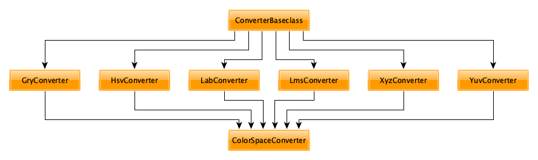

.. color-space-converter documentation master file, created by
   sphinx-quickstart on Thu Apr 16 19:32:07 2020.
   You can adapt this file completely to your liking, but it should at least
   contain the root `toctree` directive.

=================
API documentation
=================

.. toctree::
   :maxdepth: 3
   :caption: Contents:

Class hierarchy
---------------

A schematic overview of the class hierarchy is seen in the diagram below:

As the classes will be of primary interest for future extensions, all are documented hereafter.

API
---

.. automodule:: color_space_converter
.. autoclass:: ColorSpaceConverter
   :members:
   :private-members:
   :special-members:
.. autoclass:: GryConverter
   :members:
.. autoclass:: HsvConverter
   :members:
.. autoclass:: LabConverter
   :members:
.. autoclass:: LmsConverter
   :members:
.. autoclass:: XyzConverter
   :members:
.. autoclass:: YuvConverter
   :members:
.. autoclass:: ConverterBaseclass
   :members:
..	:inherited-members:

.. Indices and tables
.. ==================
.. 
.. * :ref:`genindex`
.. * :ref:`modindex`
.. * :ref:`search`
